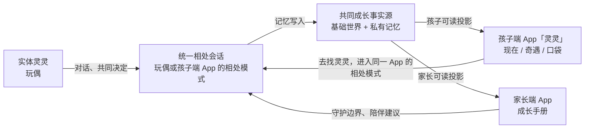

# 灵 Ling 产品设计总览

> **黑客松 Demo v1.0**
> **一句话：灵是第一只真正记得孩子的 AI 玩偶——它记得你们一起做过的每一个决定，和孩子一起成长。**

> 实现状态（2026-07-11）：孩子端 App 与家长端 PWA、受控投影和本地媒体闭环已实现；实体玩偶、正式孵化/绑定、孩子端 App 的“相处”模式、家长写入设置、通知与账户数据流程仍是目标态。逐项差异见 [实现状态](./docs/implementation-status.md)。

## 产品不是聊天 App

灵是一只共同成长的玩偶，不是把聊天机器人塞进毛绒外壳。真正的关系发生在孩子靠近玩偶、说话、一起看、一起做决定的当下。手机只有两个产品入口：孩子使用 App「灵灵」看见世界或和灵灵相处；家长使用「成长手册」理解孩子、设置边界、接住对话。

实体灵灵是玩偶形态，不构成独立 App。孩子端 App「灵灵」包含“现在 / 相处 / 奇遇 / 口袋”这些状态；其中“灵灵的窗口”只是“现在”体验的名字。网页调试台同样不是产品的一端，它只用于黑客松模拟实体玩偶、验证实时语音与记忆链路。

## 两个 App 与实体灵灵

| 类型 | 产品名 | 谁使用 | 核心价值 | 不做什么 |
|---|---|---|---|---|
| 实体玩偶 | **实体灵灵** | 孩子为主 | 面对面说话、共玩、共同做决定；关系首先发生在这里 | 复杂导航、主动追问、课堂化教学 |
| 孩子端 App | **灵灵** | 孩子 | 看见当下、进入相处、回看奇遇、收好信物 | 文字聊天记录、刷题、无限流、评分 |
| 家长端 App | **成长手册** | 家长/监护人 | 理解成长、接住对话、预先设定守护边界 | 监控、逐字转写、遥控孩子 |

两个 App 都读取同一份事实源，但绝不直接共享裸数据。实体玩偶和孩子端 App 的“相处”模式共用同一条会话与写入规则；孩子端 App 的浏览状态只读取世界、奇遇和口袋，并写入“是否收藏”的体验状态；家长端 App 只读取经过筛选的成长与守护投影。这里的差异是同一 App 内的状态差异，不是另起一套产品。

## 共同产品原则

### 陪伴优先，学习藏在生活里

英语只作为灵灵生活中的自然词出现，例如风筝是 *kite*、动物园里有 *panda*。孩子不想说英语时，灵灵立即退回纯陪伴，不纠正、不追问、不记分。

### App 把人带回玩偶

孩子端 App 的浏览内容都应该让孩子想“我要去问问灵灵”，而不是“我再刷一会儿”。“去找灵灵”会进入同一 App 的相处模式；没有文字聊天记录、连续任务、排行榜、盲盒、金币或任何无限消费机制。

### 公共生活与私有成长分开

所有灵灵共享同一套基础作息与事件语义，所以孩子会相信“灵灵不在我身边时也在生活”。孩子确认的选择和有意义互动才推进私有故事、专属瞬间与信物；公共世界不读取孩子私有记忆。

### 家长共养，不监控

家长看到的是“今晚可以和孩子聊什么”和清晰的成长变化，而不是原始转写、情绪分数或行为绩效。产品内统一使用“成长手册”，不再使用“训练师手册”。

### 夜晚自然收束

进入睡前时段，实体灵灵、孩子端 App 与家长端 App 一起变慢、变暗、变安静。产品说“灵灵要把今天收好了”，而不是“使用时长已达上限”。可用时段与休眠规则由家长预先设定，不能临时打断一段关系。

## 视觉基准：同一个世界，两种光线

已批准的视觉方向是**白天积木 + 睡前夜灯**。这不是各产品表面随意换肤，而是由统一作息驱动的世界状态。以下 token 是实体灵灵、孩子端 App 与家长端 App 的共同设计约束，后续界面重构不得改成高饱和糖果色、单一紫蓝渐变或泛 SaaS 仪表盘配色。

### 世界线视频就是界面

孩子端 App 的“现在”和“相处”状态采用同一条硬规则：**竖屏视频或实时画面必须从屏幕最上沿铺到最下沿，占满 `100dvh`，界面直接悬浮在画面上。** 它们不是页面顶部的一张卡片、一个 Hero 或带圆角的播放器；画面本身就是整个产品空间。

- 使用 9:16 竖屏母版，运行时 `object-fit: cover`，允许通过素材元数据校准 `object-position`；
- 画面延伸到系统状态栏和底部安全区之后，文字与控制避让 safe area；
- 标题、最近的世界时间节点、声音和导航以轻量叠层出现，不再另起白色内容面板；
- 顶部和底部只允许为可读性增加局部暗化，不使用可见的装饰渐变覆盖真实画面；
- 视频主体必须保留无遮挡区域，文字集中在左上，主要控制集中在底部；
- 预生成世界线不能冒充直播，状态统一写“此刻”或“现在”，只有真实实时画面才可使用 `LIVE`。

| 语义 | 白天积木 | 睡前夜灯 | 使用规则 |
|---|---|---|---|
| 画布 | 暖白 `#F2F2EF` | 靛夜 `#171822` | 大面积背景，保持安静 |
| 表面 | 白 `#FFFFFF` | 深面 `#1F2130` | 内容承托，不做厚重浮层 |
| 主交互 | 雾蓝 `#5D7FA6` | 烛光金 `#E4AE58` | 蓝色承担日间主操作；金色只在夜间主操作或值得留意处出现 |
| 文字 | 深棕灰 `#34322D` | 月白 `#E9E7F2` | 高可读，避免纯黑与刺眼白 |
| 世界点缀 | 黏土粉 `#D89B94`、积木黄 `#D8B15E`、豌豆绿 `#93AE8F` | 暮紫 `#8E8BC0`、低饱和暖金 | 只属于物件、信物和故事分类，不能铺满整页 |

视觉的共同纪律：

- 先呈现真实对象，再呈现界面：实体灵灵的灯光与动作、孩子端 App 的世界画面、家长端 App 的成长结论分别应是首屏的第一信号；
- 孩子端 App 的“现在”和“相处”采用全屏沉浸画面，不出现独立 App 顶栏、播放器边框、圆角卡片或视频下方的信息 Sheet；
- 世界线的昼夜色调首先由视频内容、灯光与调色完成，界面 token 只负责文字、状态和交互反馈；
- 家长端可用克制的分组与列表，但不做经营数据看板；
- 圆角卡片最大 8px，不做卡片套卡片；
- 动效只能表达真实状态：呼吸、微光、风、播放、生成、收入口袋与昼夜切换；必须支持“减少动态效果”。

## 一条跨端故事闭环

1. 孩子在实体灵灵，或孩子端 App 内的“相处”状态，听到一个真实的小问题，例如“生日蛋糕做橡果味还是蜂蜜味？”
2. 孩子做出选择，选择写入私有 Canon，故事推进一拍。
3. 会后生成一条候选专属瞬间；Demo 用本地素材模拟“正在变成回忆”，不依赖现场视频 API。
4. 孩子端 App 的“奇遇”发布短视频和自然产生的信物；孩子可将信物收进口袋。
5. 家长端 App 的“今日”只收到一条可带回晚饭桌的话题摘要。
6. 下次相遇时灵灵仍然记得这个选择，但不在开场抢先提起。

## 资料目录

- [孩子端 App 产品设计](./Ling-孩子端产品设计.md)：同一 App 内的`现在 / 相处 / 奇遇 / 口袋`、实体灵灵交互规则与视觉要求。
- [家长端 App 产品设计](./Ling-家长端产品设计.md)：`今日 / 成长 / 记忆 / 守护` 的完整 App 规格与边界。
- [记忆架构设计](./Ling-记忆架构设计.md)：事实源、投影、数据权利与媒体生成的技术边界。

## 黑客松范围

必须演好一条从实体灵灵到孩子端 App、再到家长端 App 的闭环。现场视频、图片和信物使用本地预生成素材与 Mock 状态机；不做真实视频生成依赖、多孩家庭、支付、社交分享、排行榜、文字聊天记录和生产级逐条数据删除。

本稿只定义跨产品的共同规则。页面结构、文案、空状态、通知和验收标准分别见孩子端 App 与家长端 App 文档；实体灵灵的相处规则已收敛在孩子端 App 文档中，避免重复维护。

## Change log

- `2026-07-11`：更新「一句话」产品定位为「第一只真正记得孩子的 AI 玩偶」，与路演口径统一；「白天积木 / 睡前夜灯」保留为视觉方向名称。
- `2026-07-11`：将原先拆开的孩子产品规格收敛为孩子端 App「灵灵」；实体灵灵是玩偶形态，“相处”是同一 App 的状态，不再作为独立产品维护。
- `2026-07-11`：补充当前实现边界；明确本稿是产品规格，不把实体硬件、正式账户和家长写入设置写成已交付。
